# Все диаграммы проекта Fitly

Данный файл содержит все Mermaid-диаграммы проекта, собранные из различных разделов документации.

## Содержание
- [Архитектура](#архитектура)
- [Диаграммы классов](#диаграммы-классов)
- [ER-диаграммы (База данных)](#er-диаграммы-база-данных)
- [Диаграммы последовательности](#диаграммы-последовательности)
- [Диаграммы состояний](#диаграммы-состояний)

---

## Архитектура

### Общая архитектура системы
*Источник: docs/architecture/system_architecture.md*

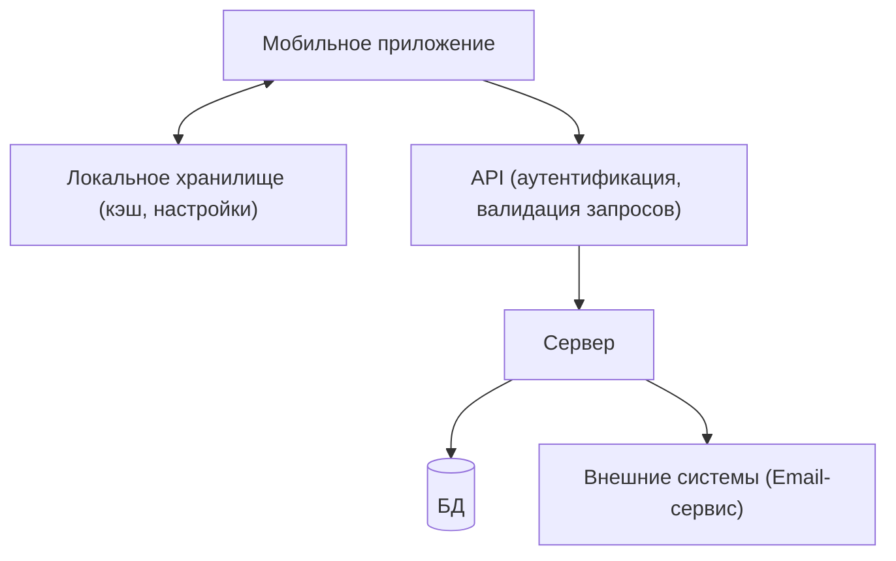
```mermaid
flowchart TD

    App["Мобильное приложение"]
    LS["Локальное хранилище (кэш, настройки)"]
    API["API (аутентификация, валидация запросов)"]
    Server["Сервер"]
    DB[("БД")]
    ES["Внешние системы (Email-сервис)"]

    App <--> LS
    App --> API
    API --> Server
    Server --> DB
    Server --> ES
```

---

## Диаграммы классов

### Полная диаграмма классов
*Источник: docs/diagrams/class/fitly-class-diagram-full.md*

```mermaid
classDiagram
    class User {
        +string id
        +string email
        +string passwordHash
        +string role
        +boolean isActive
        +string createdAt
        +string updatedAt
        +register()
        +login()
        +logout()
        +changePassword()
        +deleteAccount()
    }

    class Profile {
        +string id
        +string firstName
        +string lastName
        +string birthDate
        +string gender
        +number heightCm
        +updateProfile()
        +getAge()
    }

    class UserSettings {
        +string id
        +string theme
        +boolean doNotDisturb
        +string sleepReminderTime
        +number waterReminderIntervalMin
        +updateTheme()
        +toggleDoNotDisturb()
        +updateReminderSettings()
    }

    class Goal {
        +string id
        +string goalType
        +string title
        +number targetValue
        +string unit
        +string startDate
        +string endDate
        +string status
        +createGoal()
        +updateGoal()
        +completeGoal()
        +cancelGoal()
    }

    class WeightEntry {
        +string id
        +number weightKg
        +string recordedAt
        +addEntry()
        +editEntry()
        +deleteEntry()
    }

    class SleepEntry {
        +string id
        +string startedAt
        +string endedAt
        +number durationHours
        +string quality
        +addEntry()
        +editEntry()
        +deleteEntry()
    }

    class WaterEntry {
        +string id
        +string recordedAt
        +number amountMl
        +addEntry()
        +editEntry()
        +deleteEntry()
    }

    class MoodEntry {
        +string id
        +string recordedAt
        +string quickTag
        +number moodScore
        +string symptoms
        +string note
        +addEntry()
        +editEntry()
        +deleteEntry()
    }

    class FoodProduct {
        +string id
        +string name
        +number caloriesPer100g
        +number proteinsPer100g
        +number fatsPer100g
        +number carbsPer100g
        +boolean isActive
        +calculateNutrition(grams)
    }

    class MealEntry {
        +string id
        +string recordedAt
        +string mealType
        +string note
        +addMeal()
        +editMeal()
        +deleteMeal()
        +calculateTotalCalories()
        +calculateTotalMacros()
    }

    class MealItem {
        +string id
        +string itemName
        +number grams
        +number calories
        +number proteins
        +number fats
        +number carbs
        +calculateValues()
    }

    class WorkoutPlan {
        +string id
        +string title
        +string workoutType
        +string bodyZone
        +string intensity
        +string scheduledFor
        +string status
        +scheduleWorkout()
        +rescheduleWorkout()
        +cancelWorkout()
        +markAsCompleted()
    }

    class Exercise {
        +string id
        +string title
        +string workoutType
        +string bodyZone
        +string intensity
        +string description
        +string imageUrl
        +string videoUrl
        +boolean isActive
        +viewDetails()
    }

    class WorkoutSession {
        +string id
        +string workoutType
        +string bodyZone
        +string intensity
        +string startedAt
        +string endedAt
        +number durationMin
        +number caloriesBurned
        +string status
        +string note
        +startSession()
        +finishSession()
        +pauseSession()
        +calculateDuration()
    }

    class WorkoutExercise {
        +string id
        +number sortOrder
        +number setsCount
        +number repsCount
        +number durationSec
        +addToSession()
        +updateProgress()
    }

    class Achievement {
        +string id
        +string code
        +string title
        +string description
        +string badgeType
        +string conditionType
        +number targetValue
        +checkCondition()
    }

    class UserAchievement {
        +string id
        +number progressValue
        +boolean isCompleted
        +string earnedAt
        +updateProgress()
        +unlock()
    }

    class Notification {
        +string id
        +string type
        +string title
        +string message
        +string scheduledAt
        +string sentAt
        +boolean isRead
        +schedule()
        +send()
        +markAsRead()
    }

    class ExportRequest {
        +string id
        +string format
        +string periodType
        +string status
        +string fileUrl
        +createRequest()
        +generateFile()
        +downloadFile()
    }

    class SupportRequest {
        +string id
        +string subject
        +string message
        +string status
        +string createdAt
        +string resolvedAt
        +createRequest()
        +closeRequest()
    }

    class AdminAction {
        +string id
        +string actionType
        +string targetEntity
        +string targetId
        +string note
        +string createdAt
        +logAction()
    }

    User "1" *-- "1" Profile : has
    User "1" *-- "1" UserSettings : configures

    User "1" --> "0..*" Goal : sets
    User "1" --> "0..*" WeightEntry : records
    User "1" --> "0..*" SleepEntry : logs
    User "1" --> "0..*" WaterEntry : drinks
    User "1" --> "0..*" MoodEntry : tracks
    User "1" --> "0..*" MealEntry : adds
    User "1" --> "0..*" WorkoutPlan : schedules
    User "1" --> "0..*" WorkoutSession : performs
    User "1" --> "0..*" UserAchievement : earns
    User "1" --> "0..*" Notification : receives
    User "1" --> "0..*" ExportRequest : requests
    User "1" --> "0..*" SupportRequest : creates
    User "1" --> "0..*" AdminAction : performs

    MealEntry "1" *-- "1..*" MealItem : contains
    MealItem "*" --> "0..1" FoodProduct : basedOn

    WorkoutPlan "1" --> "0..*" WorkoutSession : resultsIn
    WorkoutSession "1" *-- "1..*" WorkoutExercise : includes
    WorkoutExercise "*" --> "1" Exercise : references

    Achievement "1" --> "0..*" UserAchievement : assignedTo
```

### Ежедневное отслеживание
*Источник: docs/diagrams/class/daily-tracking-class.md*

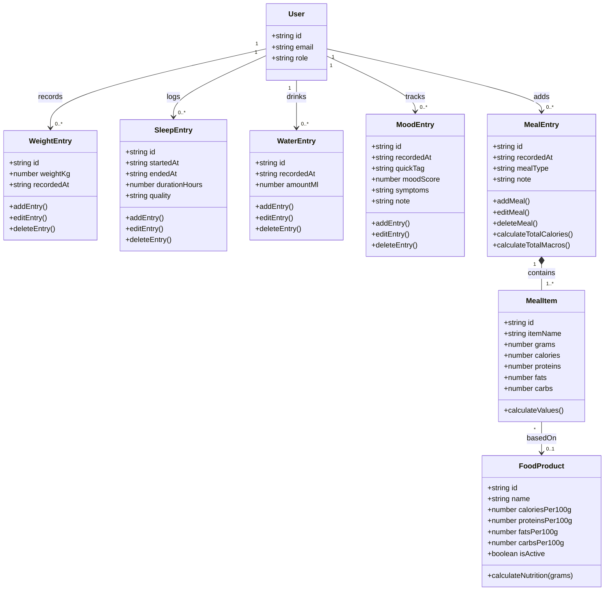
```mermaid
classDiagram
    class User {
        +string id
        +string email
        +string role
    }

    class WeightEntry {
        +string id
        +number weightKg
        +string recordedAt
        +addEntry()
        +editEntry()
        +deleteEntry()
    }

    class SleepEntry {
        +string id
        +string startedAt
        +string endedAt
        +number durationHours
        +string quality
        +addEntry()
        +editEntry()
        +deleteEntry()
    }

    class WaterEntry {
        +string id
        +string recordedAt
        +number amountMl
        +addEntry()
        +editEntry()
        +deleteEntry()
    }

    class MoodEntry {
        +string id
        +string recordedAt
        +string quickTag
        +number moodScore
        +string symptoms
        +string note
        +addEntry()
        +editEntry()
        +deleteEntry()
    }

    class FoodProduct {
        +string id
        +string name
        +number caloriesPer100g
        +number proteinsPer100g
        +number fatsPer100g
        +number carbsPer100g
        +boolean isActive
        +calculateNutrition(grams)
    }

    class MealEntry {
        +string id
        +string recordedAt
        +string mealType
        +string note
        +addMeal()
        +editMeal()
        +deleteMeal()
        +calculateTotalCalories()
        +calculateTotalMacros()
    }

    class MealItem {
        +string id
        +string itemName
        +number grams
        +number calories
        +number proteins
        +number fats
        +number carbs
        +calculateValues()
    }

    User "1" --> "0..*" WeightEntry : records
    User "1" --> "0..*" SleepEntry : logs
    User "1" --> "0..*" WaterEntry : drinks
    User "1" --> "0..*" MoodEntry : tracks
    User "1" --> "0..*" MealEntry : adds

    MealEntry "1" *-- "1..*" MealItem : contains
    MealItem "*" --> "0..1" FoodProduct : basedOn
```

### Основной домен пользователя
*Источник: docs/diagrams/class/core-user-domain-class.md*

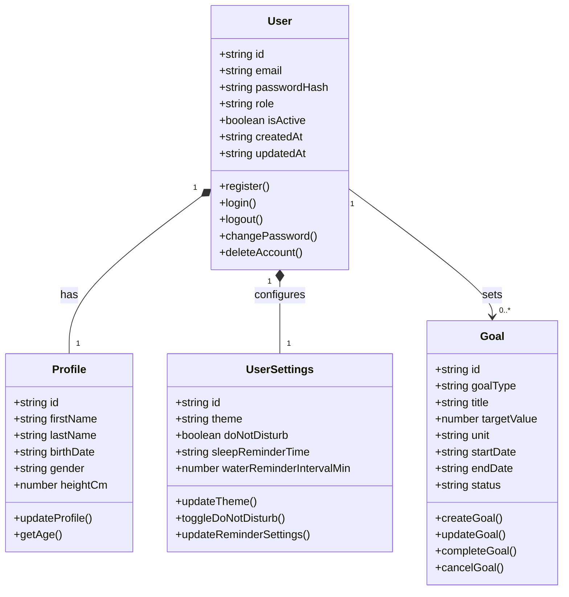
```mermaid
classDiagram
    class User {
        +string id
        +string email
        +string passwordHash
        +string role
        +boolean isActive
        +string createdAt
        +string updatedAt
        +register()
        +login()
        +logout()
        +changePassword()
        +deleteAccount()
    }

    class Profile {
        +string id
        +string firstName
        +string lastName
        +string birthDate
        +string gender
        +number heightCm
        +updateProfile()
        +getAge()
    }

    class UserSettings {
        +string id
        +string theme
        +boolean doNotDisturb
        +string sleepReminderTime
        +number waterReminderIntervalMin
        +updateTheme()
        +toggleDoNotDisturb()
        +updateReminderSettings()
    }

    class Goal {
        +string id
        +string goalType
        +string title
        +number targetValue
        +string unit
        +string startDate
        +string endDate
        +string status
        +createGoal()
        +updateGoal()
        +completeGoal()
        +cancelGoal()
    }

    User "1" *-- "1" Profile : has
    User "1" *-- "1" UserSettings : configures
    User "1" --> "0..*" Goal : sets
```

### Система активности
*Источник: docs/diagrams/class/activity-system-class.md*

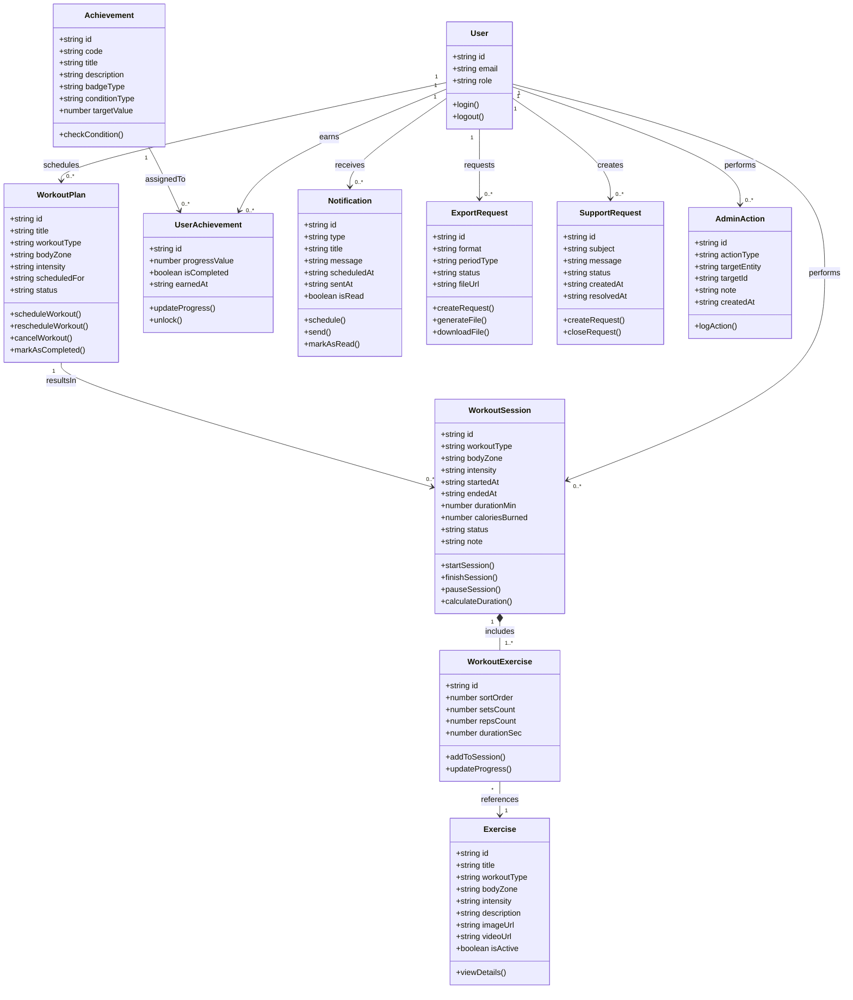
```mermaid
classDiagram
    class User {
        +string id
        +string email
        +string role
        +login()
        +logout()
    }

    class WorkoutPlan {
        +string id
        +string title
        +string workoutType
        +string bodyZone
        +string intensity
        +string scheduledFor
        +string status
        +scheduleWorkout()
        +rescheduleWorkout()
        +cancelWorkout()
        +markAsCompleted()
    }

    class Exercise {
        +string id
        +string title
        +string workoutType
        +string bodyZone
        +string intensity
        +string description
        +string imageUrl
        +string videoUrl
        +boolean isActive
        +viewDetails()
    }

    class WorkoutSession {
        +string id
        +string workoutType
        +string bodyZone
        +string intensity
        +string startedAt
        +string endedAt
        +number durationMin
        +number caloriesBurned
        +string status
        +string note
        +startSession()
        +finishSession()
        +pauseSession()
        +calculateDuration()
    }

    class WorkoutExercise {
        +string id
        +number sortOrder
        +number setsCount
        +number repsCount
        +number durationSec
        +addToSession()
        +updateProgress()
    }

    class Achievement {
        +string id
        +string code
        +string title
        +string description
        +string badgeType
        +string conditionType
        +number targetValue
        +checkCondition()
    }

    class UserAchievement {
        +string id
        +number progressValue
        +boolean isCompleted
        +string earnedAt
        +updateProgress()
        +unlock()
    }

    class Notification {
        +string id
        +string type
        +string title
        +string message
        +string scheduledAt
        +string sentAt
        +boolean isRead
        +schedule()
        +send()
        +markAsRead()
    }

    class ExportRequest {
        +string id
        +string format
        +string periodType
        +string status
        +string fileUrl
        +createRequest()
        +generateFile()
        +downloadFile()
    }

    class SupportRequest {
        +string id
        +string subject
        +string message
        +string status
        +string createdAt
        +string resolvedAt
        +createRequest()
        +closeRequest()
    }

    class AdminAction {
        +string id
        +string actionType
        +string targetEntity
        +string targetId
        +string note
        +string createdAt
        +logAction()
    }

    User "1" --> "0..*" WorkoutPlan : schedules
    User "1" --> "0..*" WorkoutSession : performs
    User "1" --> "0..*" UserAchievement : earns
    User "1" --> "0..*" Notification : receives
    User "1" --> "0..*" ExportRequest : requests
    User "1" --> "0..*" SupportRequest : creates
    User "1" --> "0..*" AdminAction : performs

    WorkoutPlan "1" --> "0..*" WorkoutSession : resultsIn
    WorkoutSession "1" *-- "1..*" WorkoutExercise : includes
    WorkoutExercise "*" --> "1" Exercise : references

    Achievement "1" --> "0..*" UserAchievement : assignedTo
```

---

## ER-диаграммы (База данных)

### Домен системы тренировок
*Источник: docs/diagrams/er/workout-system-domain.md*

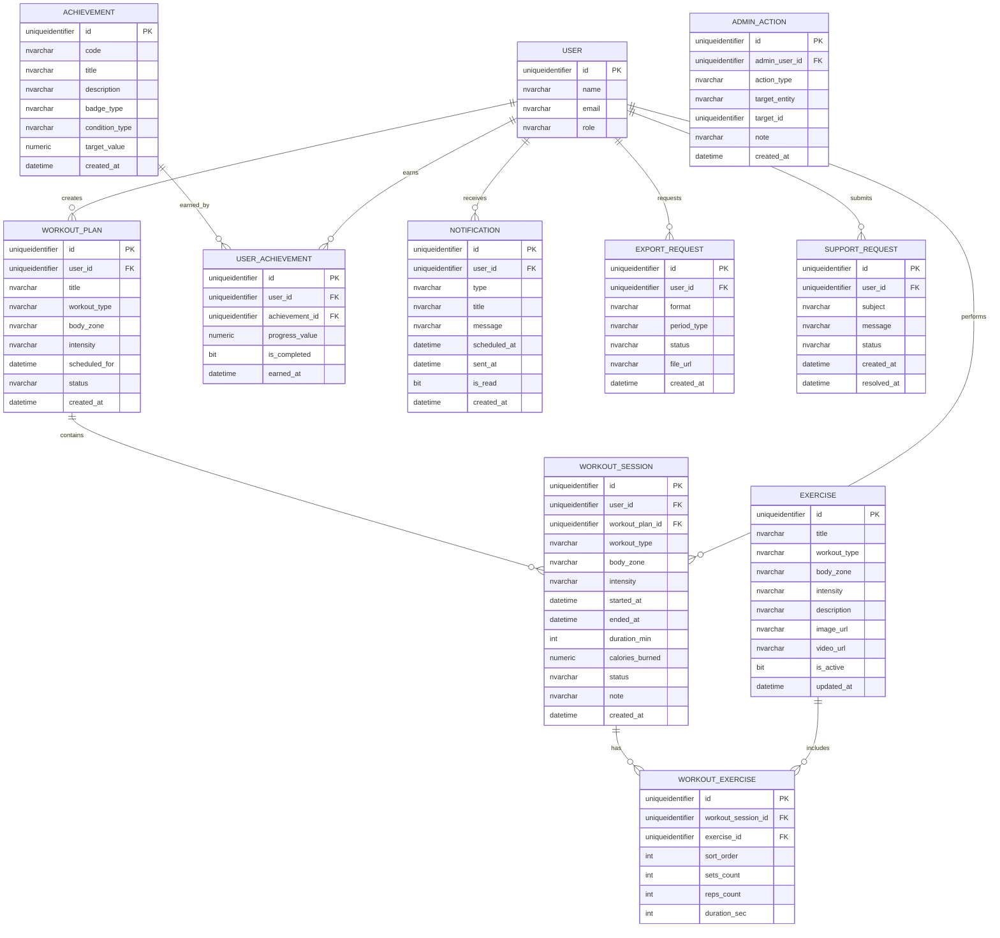
```mermaid
erDiagram
    USER {
        uniqueidentifier id PK
        nvarchar name
        nvarchar email
        nvarchar role
    }

    WORKOUT_PLAN {
        uniqueidentifier id PK
        uniqueidentifier user_id FK
        nvarchar title
        nvarchar workout_type
        nvarchar body_zone
        nvarchar intensity
        datetime scheduled_for
        nvarchar status
        datetime created_at
    }

    EXERCISE {
        uniqueidentifier id PK
        nvarchar title
        nvarchar workout_type
        nvarchar body_zone
        nvarchar intensity
        nvarchar description
        nvarchar image_url
        nvarchar video_url
        bit is_active
        datetime updated_at
    }

    WORKOUT_SESSION {
        uniqueidentifier id PK
        uniqueidentifier user_id FK
        uniqueidentifier workout_plan_id FK
        nvarchar workout_type
        nvarchar body_zone
        nvarchar intensity
        datetime started_at
        datetime ended_at
        int duration_min
        numeric calories_burned
        nvarchar status
        nvarchar note
        datetime created_at
    }

    WORKOUT_EXERCISE {
        uniqueidentifier id PK
        uniqueidentifier workout_session_id FK
        uniqueidentifier exercise_id FK
        int sort_order
        int sets_count
        int reps_count
        int duration_sec
    }

    ACHIEVEMENT {
        uniqueidentifier id PK
        nvarchar code
        nvarchar title
        nvarchar description
        nvarchar badge_type
        nvarchar condition_type
        numeric target_value
        datetime created_at
    }

    USER_ACHIEVEMENT {
        uniqueidentifier id PK
        uniqueidentifier user_id FK
        uniqueidentifier achievement_id FK
        numeric progress_value
        bit is_completed
        datetime earned_at
    }

    NOTIFICATION {
        uniqueidentifier id PK
        uniqueidentifier user_id FK
        nvarchar type
        nvarchar title
        nvarchar message
        datetime scheduled_at
        datetime sent_at
        bit is_read
        datetime created_at
    }

    EXPORT_REQUEST {
        uniqueidentifier id PK
        uniqueidentifier user_id FK
        nvarchar format
        nvarchar period_type
        nvarchar status
        nvarchar file_url
        datetime created_at
    }

    SUPPORT_REQUEST {
        uniqueidentifier id PK
        uniqueidentifier user_id FK
        nvarchar subject
        nvarchar message
        nvarchar status
        datetime created_at
        datetime resolved_at
    }

    ADMIN_ACTION {
        uniqueidentifier id PK
        uniqueidentifier admin_user_id FK
        nvarchar action_type
        nvarchar target_entity
        uniqueidentifier target_id
        nvarchar note
        datetime created_at
    }

    USER ||--o{ WORKOUT_PLAN : creates
    USER ||--o{ WORKOUT_SESSION : performs
    USER ||--o{ USER_ACHIEVEMENT : earns
    USER ||--o{ NOTIFICATION : receives
    USER ||--o{ EXPORT_REQUEST : requests
    USER ||--o{ SUPPORT_REQUEST : submits
    WORKOUT_PLAN ||--o{ WORKOUT_SESSION : contains
    EXERCISE ||--o{ WORKOUT_EXERCISE : includes
    WORKOUT_SESSION ||--o{ WORKOUT_EXERCISE : has
    ACHIEVEMENT ||--o{ USER_ACHIEVEMENT : earned_by
```

### Домен здоровья и питания
*Источник: docs/diagrams/er/health-nutrition-domain.md*

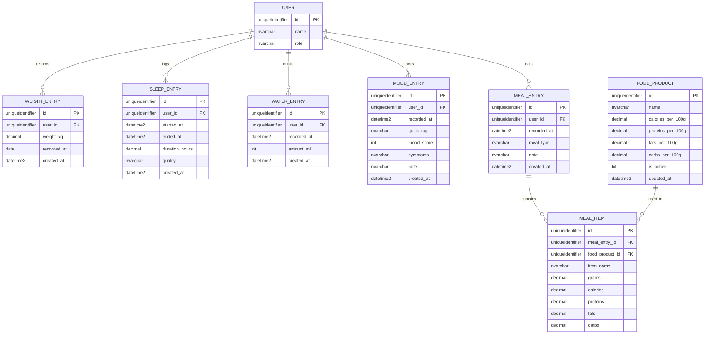
```mermaid
erDiagram
    USER {
        uniqueidentifier id PK
        nvarchar name
        nvarchar role
    }

    WEIGHT_ENTRY {
        uniqueidentifier id PK
        uniqueidentifier user_id FK
        decimal weight_kg
        date recorded_at
        datetime2 created_at
    }

    SLEEP_ENTRY {
        uniqueidentifier id PK
        uniqueidentifier user_id FK
        datetime2 started_at
        datetime2 ended_at
        decimal duration_hours
        nvarchar quality
        datetime2 created_at
    }

    WATER_ENTRY {
        uniqueidentifier id PK
        uniqueidentifier user_id FK
        datetime2 recorded_at
        int amount_ml
        datetime2 created_at
    }

    MOOD_ENTRY {
        uniqueidentifier id PK
        uniqueidentifier user_id FK
        datetime2 recorded_at
        nvarchar quick_tag
        int mood_score
        nvarchar symptoms
        nvarchar note
        datetime2 created_at
    }

    FOOD_PRODUCT {
        uniqueidentifier id PK
        nvarchar name
        decimal calories_per_100g
        decimal proteins_per_100g
        decimal fats_per_100g
        decimal carbs_per_100g
        bit is_active
        datetime2 updated_at
    }

    MEAL_ENTRY {
        uniqueidentifier id PK
        uniqueidentifier user_id FK
        datetime2 recorded_at
        nvarchar meal_type
        nvarchar note
        datetime2 created_at
    }

    MEAL_ITEM {
        uniqueidentifier id PK
        uniqueidentifier meal_entry_id FK
        uniqueidentifier food_product_id FK
        nvarchar item_name
        decimal grams
        decimal calories
        decimal proteins
        decimal fats
        decimal carbs
    }

    USER ||--o{ WEIGHT_ENTRY : records
    USER ||--o{ SLEEP_ENTRY : logs
    USER ||--o{ WATER_ENTRY : drinks
    USER ||--o{ MOOD_ENTRY : tracks
    USER ||--o{ MEAL_ENTRY : eats
    MEAL_ENTRY ||--o{ MEAL_ITEM : contains
    FOOD_PRODUCT ||--o{ MEAL_ITEM : used_in
```

### Основной домен пользователя (ER)
*Источник: docs/diagrams/er/core-user-domain.md*

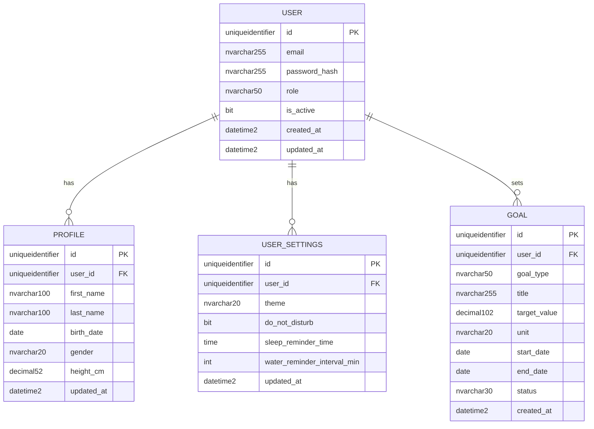
```mermaid
erDiagram

    USER {
        uniqueidentifier id PK
        nvarchar255 email
        nvarchar255 password_hash
        nvarchar50 role
        bit is_active
        datetime2 created_at
        datetime2 updated_at
    }

    PROFILE {
        uniqueidentifier id PK
        uniqueidentifier user_id FK
        nvarchar100 first_name
        nvarchar100 last_name
        date birth_date
        nvarchar20 gender
        decimal52 height_cm
        datetime2 updated_at
    }

    USER_SETTINGS {
        uniqueidentifier id PK
        uniqueidentifier user_id FK
        nvarchar20 theme
        bit do_not_disturb
        time sleep_reminder_time
        int water_reminder_interval_min
        datetime2 updated_at
    }

    GOAL {
        uniqueidentifier id PK
        uniqueidentifier user_id FK
        nvarchar50 goal_type
        nvarchar255 title
        decimal102 target_value
        nvarchar20 unit
        date start_date
        date end_date
        nvarchar30 status
        datetime2 created_at
    }

    USER ||--o{ PROFILE : has
    USER ||--o{ USER_SETTINGS : has
    USER ||--o{ GOAL : sets
```

---

## Диаграммы последовательности

### Безопасность (Удаление аккаунта)
*Источник: docs/diagrams/sequence/security.md*

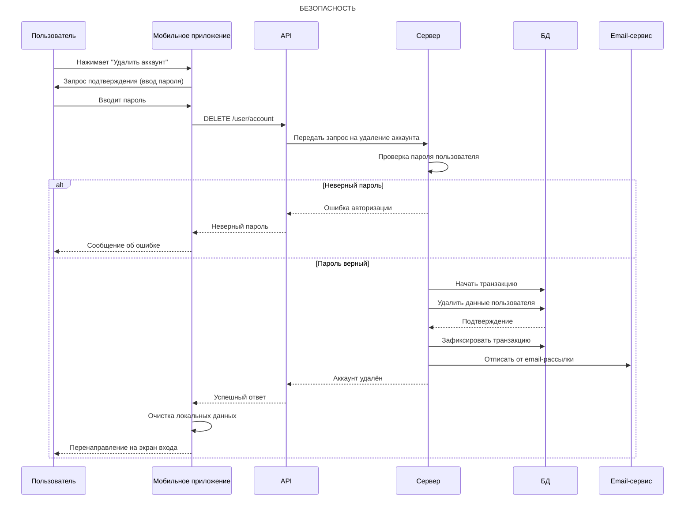
```mermaid
sequenceDiagram
    title БЕЗОПАСНОСТЬ
    participant U as Пользователь
    participant App as Мобильное приложение
    participant API as API
    participant S as Сервер
    participant DB as БД
    participant ES as Email-сервис

    U->>App: Нажимает "Удалить аккаунт"
    App->>U: Запрос подтверждения (ввод пароля)
    U->>App: Вводит пароль

    App->>API: DELETE /user/account
    API->>S: Передать запрос на удаление аккаунта

    S->>S: Проверка пароля пользователя

    alt Неверный пароль
        S-->>API: Ошибка авторизации
        API-->>App: Неверный пароль
        App-->>U: Сообщение об ошибке
    else Пароль верный
        S->>DB: Начать транзакцию
        S->>DB: Удалить данные пользователя
        DB-->>S: Подтверждение
        S->>DB: Зафиксировать транзакцию

        S->>ES: Отписать от email-рассылки

        S-->>API: Аккаунт удалён
        API-->>App: Успешный ответ
        App->>App: Очистка локальных данных
        App-->>U: Перенаправление на экран входа
    end
```

### Профиль (Получение и обновление)
*Источник: docs/diagrams/sequence/profile.md*

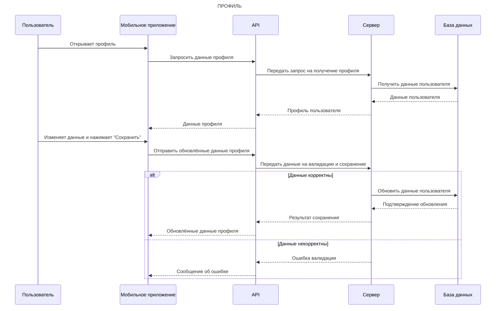
```mermaid
sequenceDiagram
    title ПРОФИЛЬ
    participant U as Пользователь
    participant A as Мобильное приложение
    participant API as API
    participant S as Сервер
    participant DB as База данных

    U->>A: Открывает профиль
    A->>API: Запросить данные профиля
    API->>S: Передать запрос на получение профиля
    S->>DB: Получить данные пользователя
    DB-->>S: Данные пользователя
    S-->>API: Профиль пользователя
    API-->>A: Данные профиля

    U->>A: Изменяет данные и нажимает "Сохранить"
    A->>API: Отправить обновлённые данные профиля
    API->>S: Передать данные на валидацию и сохранение

    alt Данные корректны
        S->>DB: Обновить данные пользователя
        DB-->>S: Подтверждение обновления
        S-->>API: Результат сохранения
        API-->>A: Обновлённые данные профиля
    else Данные некорректны
        S-->>API: Ошибка валидации
        API-->>A: Сообщение об ошибке
    end
```

### Админ-функции (Статистика)
*Источник: docs/diagrams/sequence/admin.md*

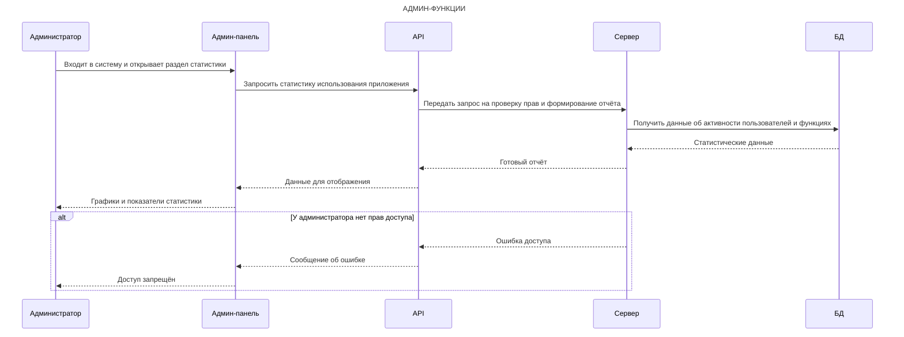
```mermaid
sequenceDiagram
    title АДМИН-ФУНКЦИИ
    participant Adm as Администратор
    participant AP as Админ-панель
    participant API as API
    participant S as Сервер
    participant DB as БД

    Adm->>AP: Входит в систему и открывает раздел статистики
    AP->>API: Запросить статистику использования приложения
    API->>S: Передать запрос на проверку прав и формирование отчёта
    S->>DB: Получить данные об активности пользователей и функциях
    DB-->>S: Статистические данные
    S-->>API: Готовый отчёт
    API-->>AP: Данные для отображения
    AP-->>Adm: Графики и показатели статистики

    alt У администратора нет прав доступа
        S-->>API: Ошибка доступа
        API-->>AP: Сообщение об ошибке
        AP-->>Adm: Доступ запрещён
    end
```

### Аутентификация
*Источник: docs/diagrams/sequence/auth.md*

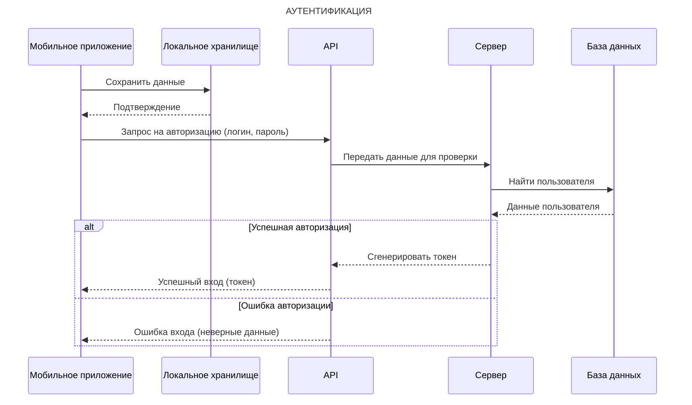
```mermaid
sequenceDiagram
    title АУТЕНТИФИКАЦИЯ
    participant App as Мобильное приложение
    participant LS as Локальное хранилище
    participant API as API
    participant Server as Сервер
    participant DB as База данных

    App->>LS: Сохранить данные
    LS-->>App: Подтверждение

    App->>API: Запрос на авторизацию (логин, пароль)
    API->>Server: Передать данные для проверки
    Server->>DB: Найти пользователя
    DB-->>Server: Данные пользователя

    alt Успешная авторизация
        Server-->>API: Сгенерировать токен
        API-->>App: Успешный вход (токен)
    else Ошибка авторизации
        API-->>App: Ошибка входа (неверные данные)
    end
```

---

## Диаграммы состояний

### Обращение в поддержку
*Источник: docs/diagrams/state/support-request-state.md*

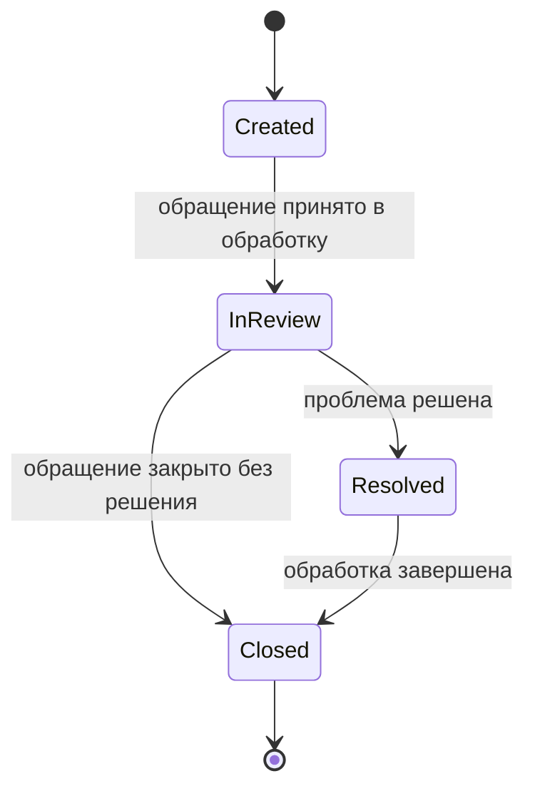
```mermaid
stateDiagram-v2
    [*] --> Created

    Created --> InReview: обращение принято в обработку
    InReview --> Resolved: проблема решена
    InReview --> Closed: обращение закрыто без решения

    Resolved --> Closed: обработка завершена

    Closed --> [*]
```

### План тренировки
*Источник: docs/diagrams/state/workout-plan-state.md*

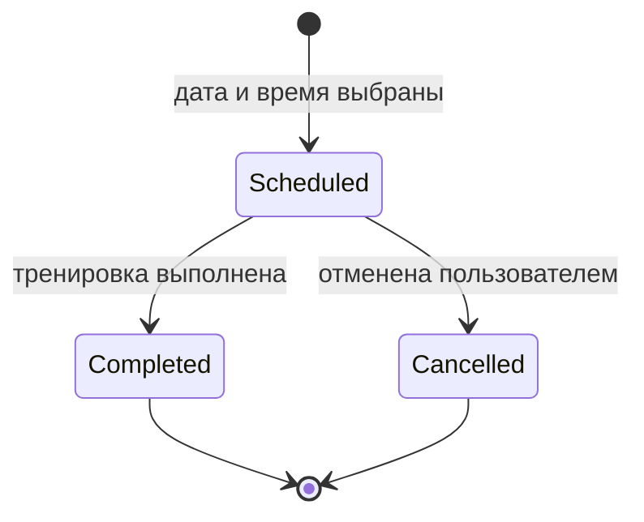
```mermaid
stateDiagram-v2
    [*] --> Scheduled: дата и время выбраны

    Scheduled --> Completed: тренировка выполнена
    Scheduled --> Cancelled: отменена пользователем

    Completed --> [*]
    Cancelled --> [*]
```

### Аккаунт пользователя
*Источник: docs/diagrams/state/user-account-state.md*

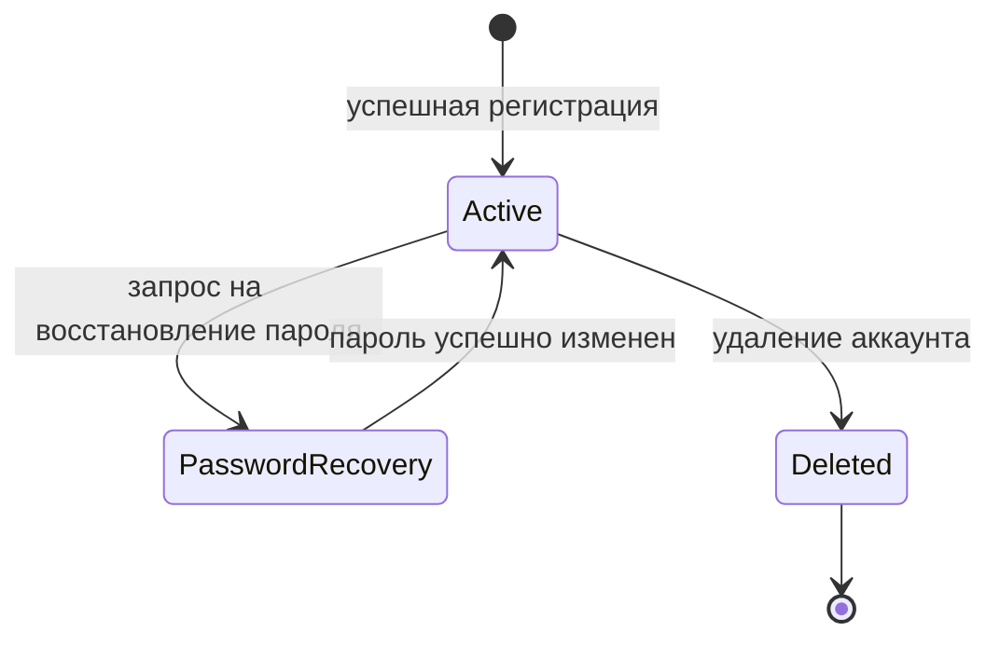
```mermaid
stateDiagram-v2
    [*] --> Active: успешная регистрация

    Active --> PasswordRecovery: запрос на восстановление пароля
    PasswordRecovery --> Active: пароль успешно изменен

    Active --> Deleted: удаление аккаунта
    Deleted --> [*]
```

### Уведомление
*Источник: docs/diagrams/state/notification-state.md*

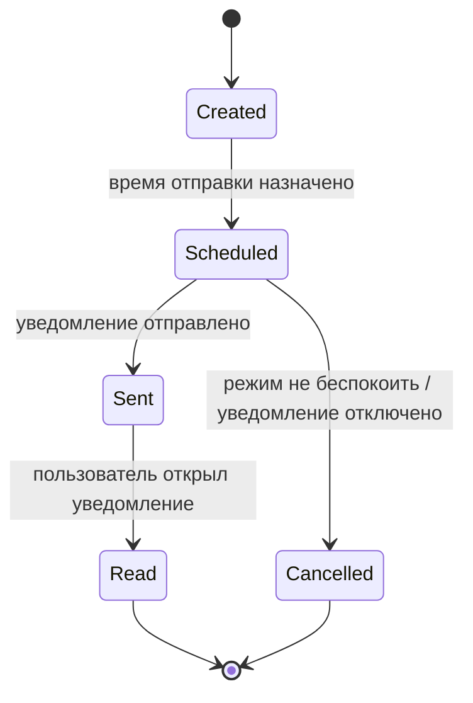
```mermaid
stateDiagram-v2
    [*] --> Created

    Created --> Scheduled: время отправки назначено
    Scheduled --> Sent: уведомление отправлено
    Scheduled --> Cancelled: режим не беспокоить / уведомление отключено

    Sent --> Read: пользователь открыл уведомление

    Read --> [*]
    Cancelled --> [*]
```

### Цель
*Источник: docs/diagrams/state/goal-state.md*

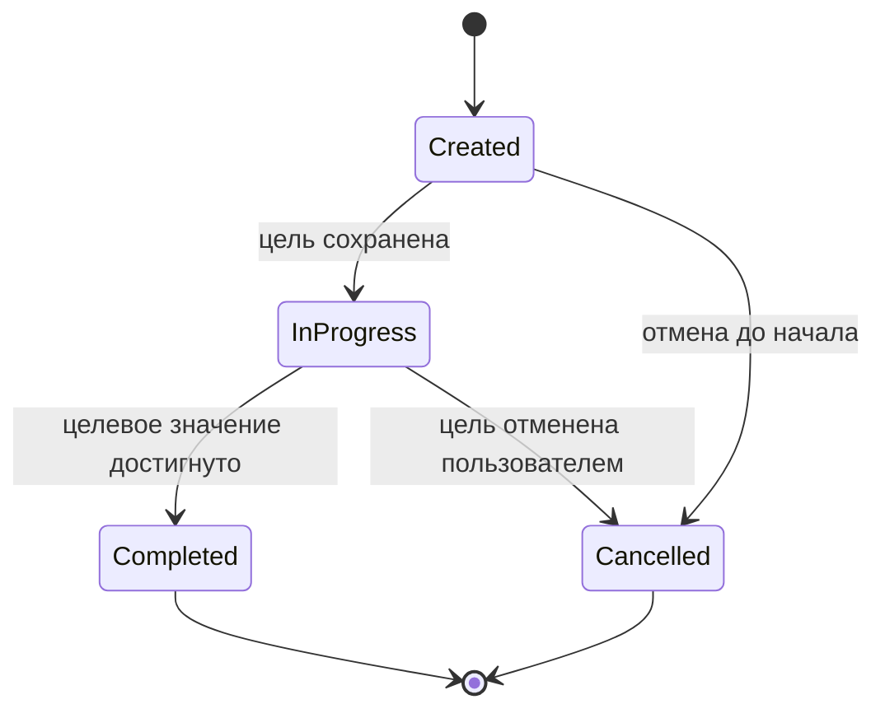
```mermaid
stateDiagram-v2
    [*] --> Created

    Created --> InProgress: цель сохранена
    Created --> Cancelled: отмена до начала

    InProgress --> Completed: целевое значение достигнуто
    InProgress --> Cancelled: цель отменена пользователем

    Completed --> [*]
    Cancelled --> [*]
```

### Запрос на экспорт
*Источник: docs/diagrams/state/export-request-state.md*

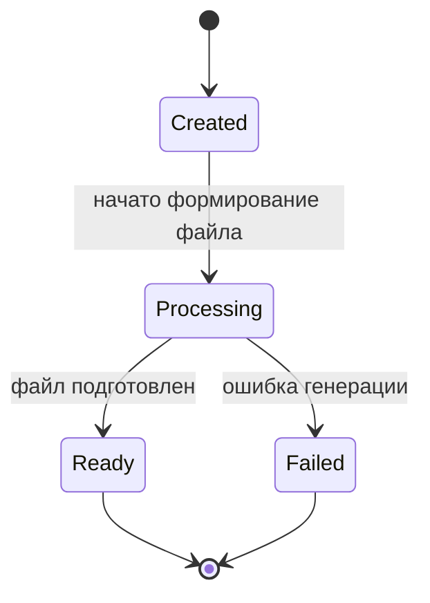
```mermaid
stateDiagram-v2
    [*] --> Created

    Created --> Processing: начато формирование файла
    Processing --> Ready: файл подготовлен
    Processing --> Failed: ошибка генерации

    Ready --> [*]
    Failed --> [*]
```

### Сессия аутентификации
*Источник: docs/diagrams/state/auth-session-state.md*

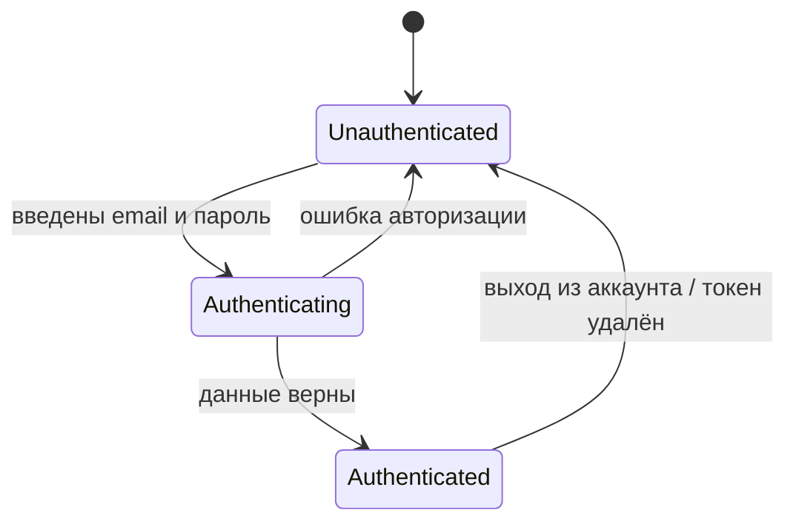
```mermaid
stateDiagram-v2
    [*] --> Unauthenticated

    Unauthenticated --> Authenticating: введены email и пароль
    Authenticating --> Authenticated: данные верны
    Authenticating --> Unauthenticated: ошибка авторизации

    Authenticated --> Unauthenticated: выход из аккаунта / токен удалён
```

### Достижение
*Источник: docs/diagrams/state/achievement-state.md*

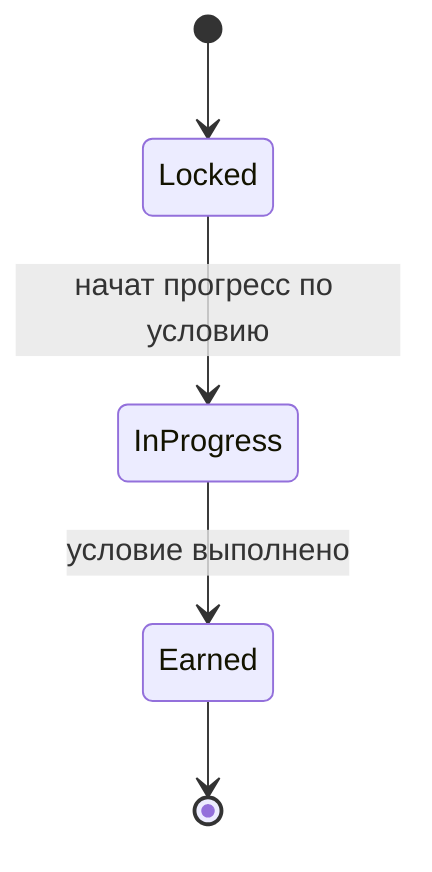
```mermaid
stateDiagram-v2
    [*] --> Locked

    Locked --> InProgress: начат прогресс по условию
    InProgress --> Earned: условие выполнено

    Earned --> [*]
```
