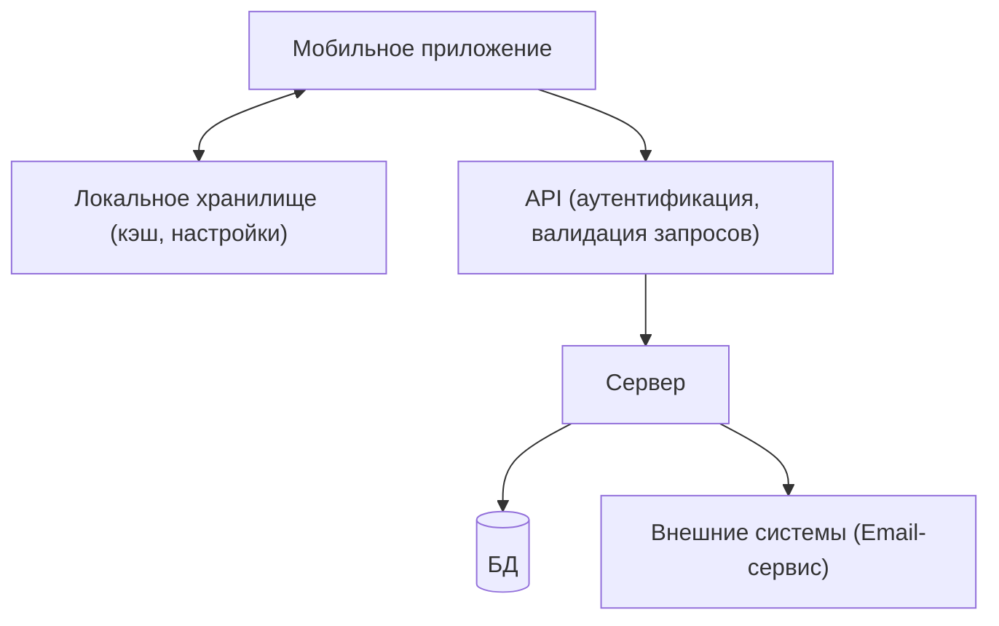

# Архитектура системы Fitly

```mermaid
flowchart TD

    App["Мобильное приложение"]
    LS["Локальное хранилище (кэш, настройки)"]
    API["API (аутентификация, валидация запросов)"]
    Server["Сервер"]
    DB[("БД")]
    ES["Внешние системы (Email-сервис)"]

    App <--> LS
    App --> API
    API --> Server
    Server --> DB
    Server --> ES
```