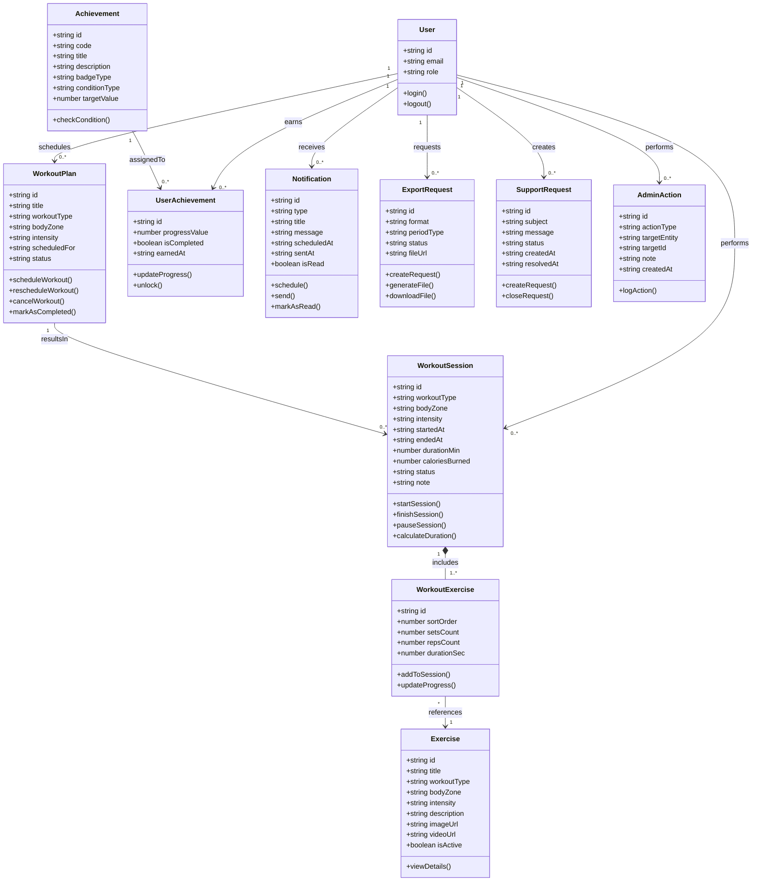

```mermaid
classDiagram
    class User {
        +string id
        +string email
        +string role
        +login()
        +logout()
    }

    class WorkoutPlan {
        +string id
        +string title
        +string workoutType
        +string bodyZone
        +string intensity
        +string scheduledFor
        +string status
        +scheduleWorkout()
        +rescheduleWorkout()
        +cancelWorkout()
        +markAsCompleted()
    }

    class Exercise {
        +string id
        +string title
        +string workoutType
        +string bodyZone
        +string intensity
        +string description
        +string imageUrl
        +string videoUrl
        +boolean isActive
        +viewDetails()
    }

    class WorkoutSession {
        +string id
        +string workoutType
        +string bodyZone
        +string intensity
        +string startedAt
        +string endedAt
        +number durationMin
        +number caloriesBurned
        +string status
        +string note
        +startSession()
        +finishSession()
        +pauseSession()
        +calculateDuration()
    }

    class WorkoutExercise {
        +string id
        +number sortOrder
        +number setsCount
        +number repsCount
        +number durationSec
        +addToSession()
        +updateProgress()
    }

    class Achievement {
        +string id
        +string code
        +string title
        +string description
        +string badgeType
        +string conditionType
        +number targetValue
        +checkCondition()
    }

    class UserAchievement {
        +string id
        +number progressValue
        +boolean isCompleted
        +string earnedAt
        +updateProgress()
        +unlock()
    }

    class Notification {
        +string id
        +string type
        +string title
        +string message
        +string scheduledAt
        +string sentAt
        +boolean isRead
        +schedule()
        +send()
        +markAsRead()
    }

    class ExportRequest {
        +string id
        +string format
        +string periodType
        +string status
        +string fileUrl
        +createRequest()
        +generateFile()
        +downloadFile()
    }

    class SupportRequest {
        +string id
        +string subject
        +string message
        +string status
        +string createdAt
        +string resolvedAt
        +createRequest()
        +closeRequest()
    }

    class AdminAction {
        +string id
        +string actionType
        +string targetEntity
        +string targetId
        +string note
        +string createdAt
        +logAction()
    }

    User "1" --> "0..*" WorkoutPlan : schedules
    User "1" --> "0..*" WorkoutSession : performs
    User "1" --> "0..*" UserAchievement : earns
    User "1" --> "0..*" Notification : receives
    User "1" --> "0..*" ExportRequest : requests
    User "1" --> "0..*" SupportRequest : creates
    User "1" --> "0..*" AdminAction : performs

    WorkoutPlan "1" --> "0..*" WorkoutSession : resultsIn
    WorkoutSession "1" *-- "1..*" WorkoutExercise : includes
    WorkoutExercise "*" --> "1" Exercise : references

    Achievement "1" --> "0..*" UserAchievement : assignedTo
```