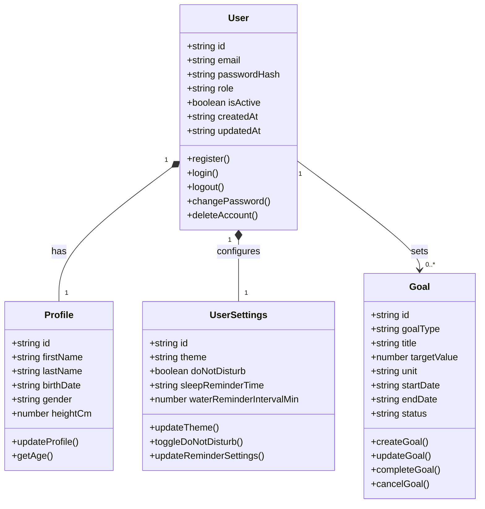

```mermaid
classDiagram
    class User {
        +string id
        +string email
        +string passwordHash
        +string role
        +boolean isActive
        +string createdAt
        +string updatedAt
        +register()
        +login()
        +logout()
        +changePassword()
        +deleteAccount()
    }

    class Profile {
        +string id
        +string firstName
        +string lastName
        +string birthDate
        +string gender
        +number heightCm
        +updateProfile()
        +getAge()
    }

    class UserSettings {
        +string id
        +string theme
        +boolean doNotDisturb
        +string sleepReminderTime
        +number waterReminderIntervalMin
        +updateTheme()
        +toggleDoNotDisturb()
        +updateReminderSettings()
    }

    class Goal {
        +string id
        +string goalType
        +string title
        +number targetValue
        +string unit
        +string startDate
        +string endDate
        +string status
        +createGoal()
        +updateGoal()
        +completeGoal()
        +cancelGoal()
    }

    User "1" *-- "1" Profile : has
    User "1" *-- "1" UserSettings : configures
    User "1" --> "0..*" Goal : sets
```