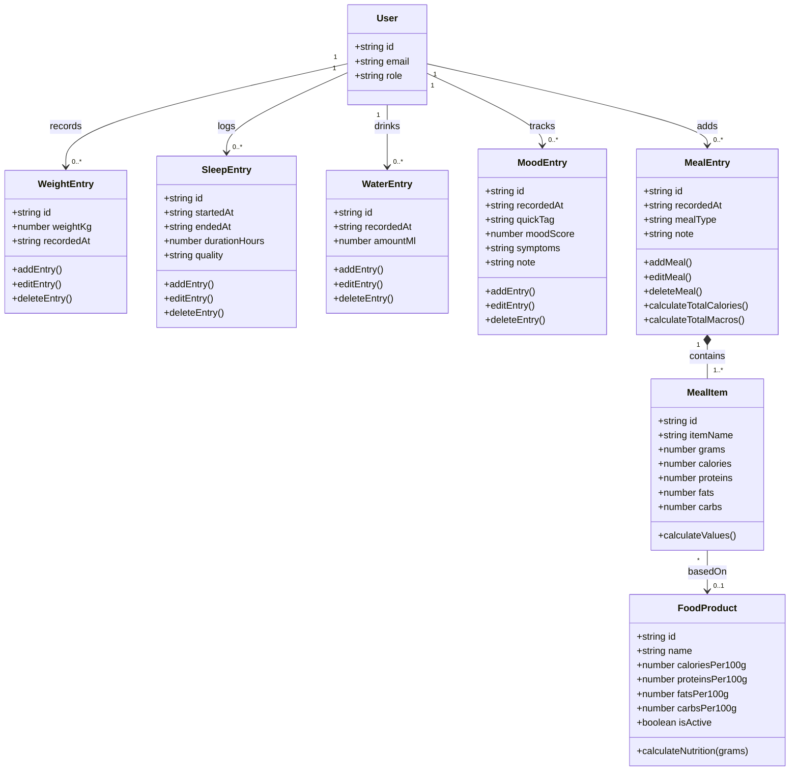

```mermaid
classDiagram
    class User {
        +string id
        +string email
        +string role
    }

    class WeightEntry {
        +string id
        +number weightKg
        +string recordedAt
        +addEntry()
        +editEntry()
        +deleteEntry()
    }

    class SleepEntry {
        +string id
        +string startedAt
        +string endedAt
        +number durationHours
        +string quality
        +addEntry()
        +editEntry()
        +deleteEntry()
    }

    class WaterEntry {
        +string id
        +string recordedAt
        +number amountMl
        +addEntry()
        +editEntry()
        +deleteEntry()
    }

    class MoodEntry {
        +string id
        +string recordedAt
        +string quickTag
        +number moodScore
        +string symptoms
        +string note
        +addEntry()
        +editEntry()
        +deleteEntry()
    }

    class FoodProduct {
        +string id
        +string name
        +number caloriesPer100g
        +number proteinsPer100g
        +number fatsPer100g
        +number carbsPer100g
        +boolean isActive
        +calculateNutrition(grams)
    }

    class MealEntry {
        +string id
        +string recordedAt
        +string mealType
        +string note
        +addMeal()
        +editMeal()
        +deleteMeal()
        +calculateTotalCalories()
        +calculateTotalMacros()
    }

    class MealItem {
        +string id
        +string itemName
        +number grams
        +number calories
        +number proteins
        +number fats
        +number carbs
        +calculateValues()
    }

    User "1" --> "0..*" WeightEntry : records
    User "1" --> "0..*" SleepEntry : logs
    User "1" --> "0..*" WaterEntry : drinks
    User "1" --> "0..*" MoodEntry : tracks
    User "1" --> "0..*" MealEntry : adds

    MealEntry "1" *-- "1..*" MealItem : contains
    MealItem "*" --> "0..1" FoodProduct : basedOn
```