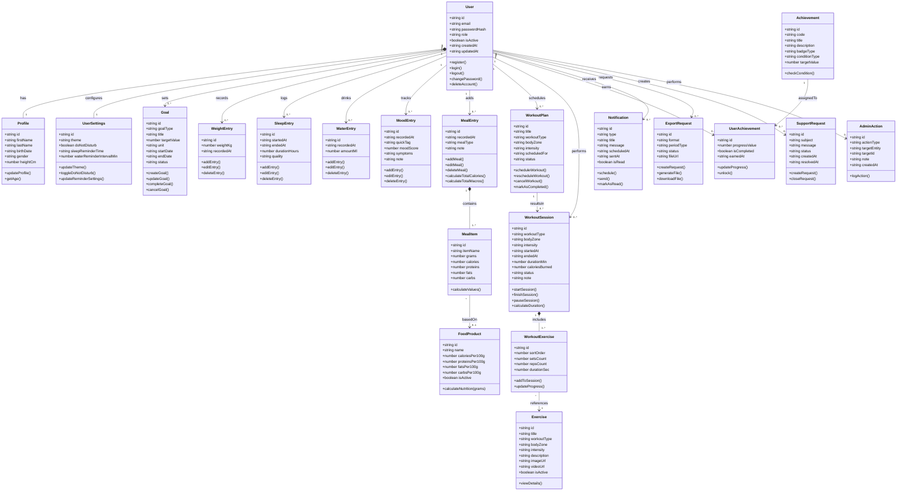

```mermaid
classDiagram
    class User {
        +string id
        +string email
        +string passwordHash
        +string role
        +boolean isActive
        +string createdAt
        +string updatedAt
        +register()
        +login()
        +logout()
        +changePassword()
        +deleteAccount()
    }

    class Profile {
        +string id
        +string firstName
        +string lastName
        +string birthDate
        +string gender
        +number heightCm
        +updateProfile()
        +getAge()
    }

    class UserSettings {
        +string id
        +string theme
        +boolean doNotDisturb
        +string sleepReminderTime
        +number waterReminderIntervalMin
        +updateTheme()
        +toggleDoNotDisturb()
        +updateReminderSettings()
    }

    class Goal {
        +string id
        +string goalType
        +string title
        +number targetValue
        +string unit
        +string startDate
        +string endDate
        +string status
        +createGoal()
        +updateGoal()
        +completeGoal()
        +cancelGoal()
    }

    class WeightEntry {
        +string id
        +number weightKg
        +string recordedAt
        +addEntry()
        +editEntry()
        +deleteEntry()
    }

    class SleepEntry {
        +string id
        +string startedAt
        +string endedAt
        +number durationHours
        +string quality
        +addEntry()
        +editEntry()
        +deleteEntry()
    }

    class WaterEntry {
        +string id
        +string recordedAt
        +number amountMl
        +addEntry()
        +editEntry()
        +deleteEntry()
    }

    class MoodEntry {
        +string id
        +string recordedAt
        +string quickTag
        +number moodScore
        +string symptoms
        +string note
        +addEntry()
        +editEntry()
        +deleteEntry()
    }

    class FoodProduct {
        +string id
        +string name
        +number caloriesPer100g
        +number proteinsPer100g
        +number fatsPer100g
        +number carbsPer100g
        +boolean isActive
        +calculateNutrition(grams)
    }

    class MealEntry {
        +string id
        +string recordedAt
        +string mealType
        +string note
        +addMeal()
        +editMeal()
        +deleteMeal()
        +calculateTotalCalories()
        +calculateTotalMacros()
    }

    class MealItem {
        +string id
        +string itemName
        +number grams
        +number calories
        +number proteins
        +number fats
        +number carbs
        +calculateValues()
    }

    class WorkoutPlan {
        +string id
        +string title
        +string workoutType
        +string bodyZone
        +string intensity
        +string scheduledFor
        +string status
        +scheduleWorkout()
        +rescheduleWorkout()
        +cancelWorkout()
        +markAsCompleted()
    }

    class Exercise {
        +string id
        +string title
        +string workoutType
        +string bodyZone
        +string intensity
        +string description
        +string imageUrl
        +string videoUrl
        +boolean isActive
        +viewDetails()
    }

    class WorkoutSession {
        +string id
        +string workoutType
        +string bodyZone
        +string intensity
        +string startedAt
        +string endedAt
        +number durationMin
        +number caloriesBurned
        +string status
        +string note
        +startSession()
        +finishSession()
        +pauseSession()
        +calculateDuration()
    }

    class WorkoutExercise {
        +string id
        +number sortOrder
        +number setsCount
        +number repsCount
        +number durationSec
        +addToSession()
        +updateProgress()
    }

    class Achievement {
        +string id
        +string code
        +string title
        +string description
        +string badgeType
        +string conditionType
        +number targetValue
        +checkCondition()
    }

    class UserAchievement {
        +string id
        +number progressValue
        +boolean isCompleted
        +string earnedAt
        +updateProgress()
        +unlock()
    }

    class Notification {
        +string id
        +string type
        +string title
        +string message
        +string scheduledAt
        +string sentAt
        +boolean isRead
        +schedule()
        +send()
        +markAsRead()
    }

    class ExportRequest {
        +string id
        +string format
        +string periodType
        +string status
        +string fileUrl
        +createRequest()
        +generateFile()
        +downloadFile()
    }

    class SupportRequest {
        +string id
        +string subject
        +string message
        +string status
        +string createdAt
        +string resolvedAt
        +createRequest()
        +closeRequest()
    }

    class AdminAction {
        +string id
        +string actionType
        +string targetEntity
        +string targetId
        +string note
        +string createdAt
        +logAction()
    }

    User "1" *-- "1" Profile : has
    User "1" *-- "1" UserSettings : configures

    User "1" --> "0..*" Goal : sets
    User "1" --> "0..*" WeightEntry : records
    User "1" --> "0..*" SleepEntry : logs
    User "1" --> "0..*" WaterEntry : drinks
    User "1" --> "0..*" MoodEntry : tracks
    User "1" --> "0..*" MealEntry : adds
    User "1" --> "0..*" WorkoutPlan : schedules
    User "1" --> "0..*" WorkoutSession : performs
    User "1" --> "0..*" UserAchievement : earns
    User "1" --> "0..*" Notification : receives
    User "1" --> "0..*" ExportRequest : requests
    User "1" --> "0..*" SupportRequest : creates
    User "1" --> "0..*" AdminAction : performs

    MealEntry "1" *-- "1..*" MealItem : contains
    MealItem "*" --> "0..1" FoodProduct : basedOn

    WorkoutPlan "1" --> "0..*" WorkoutSession : resultsIn
    WorkoutSession "1" *-- "1..*" WorkoutExercise : includes
    WorkoutExercise "*" --> "1" Exercise : references

    Achievement "1" --> "0..*" UserAchievement : assignedTo
```