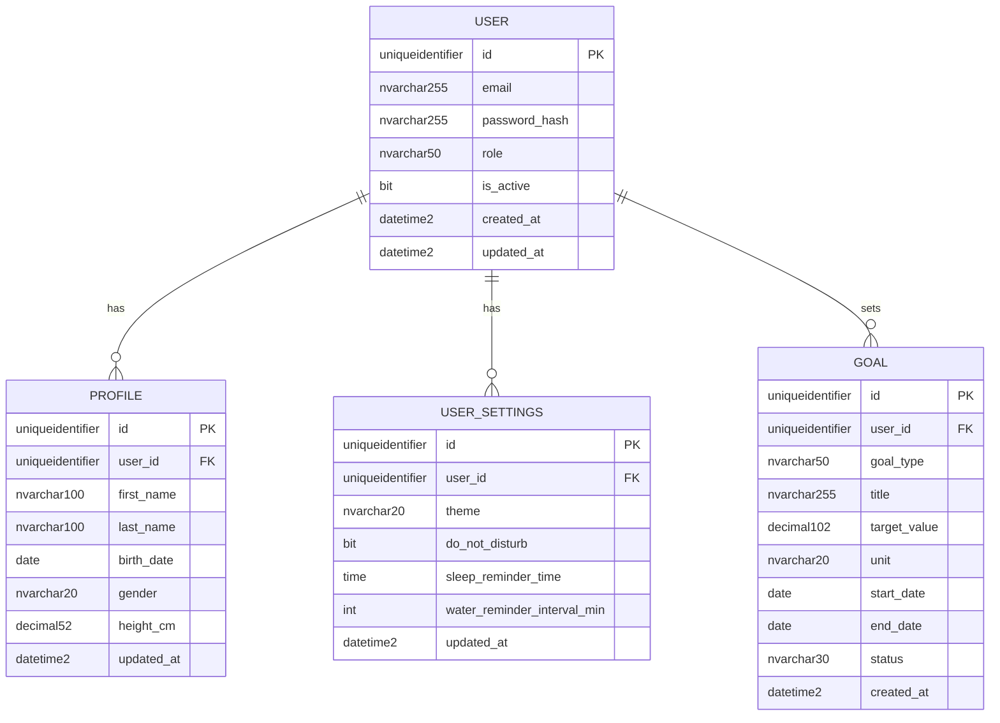

```mermaid
erDiagram

    USER {
        uniqueidentifier id PK
        nvarchar255 email
        nvarchar255 password_hash
        nvarchar50 role
        bit is_active
        datetime2 created_at
        datetime2 updated_at
    }

    PROFILE {
        uniqueidentifier id PK
        uniqueidentifier user_id FK
        nvarchar100 first_name
        nvarchar100 last_name
        date birth_date
        nvarchar20 gender
        decimal52 height_cm
        datetime2 updated_at
    }

    USER_SETTINGS {
        uniqueidentifier id PK
        uniqueidentifier user_id FK
        nvarchar20 theme
        bit do_not_disturb
        time sleep_reminder_time
        int water_reminder_interval_min
        datetime2 updated_at
    }

    GOAL {
        uniqueidentifier id PK
        uniqueidentifier user_id FK
        nvarchar50 goal_type
        nvarchar255 title
        decimal102 target_value
        nvarchar20 unit
        date start_date
        date end_date
        nvarchar30 status
        datetime2 created_at
    }

    USER ||--o{ PROFILE : has
    USER ||--o{ USER_SETTINGS : has
    USER ||--o{ GOAL : sets
```