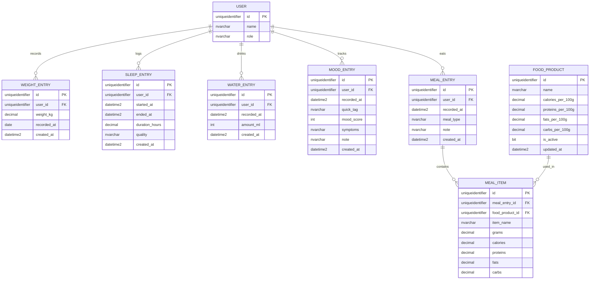

```mermaid
erDiagram
    USER {
        uniqueidentifier id PK
        nvarchar name
        nvarchar role
    }

    WEIGHT_ENTRY {
        uniqueidentifier id PK
        uniqueidentifier user_id FK
        decimal weight_kg
        date recorded_at
        datetime2 created_at
    }

    SLEEP_ENTRY {
        uniqueidentifier id PK
        uniqueidentifier user_id FK
        datetime2 started_at
        datetime2 ended_at
        decimal duration_hours
        nvarchar quality
        datetime2 created_at
    }

    WATER_ENTRY {
        uniqueidentifier id PK
        uniqueidentifier user_id FK
        datetime2 recorded_at
        int amount_ml
        datetime2 created_at
    }

    MOOD_ENTRY {
        uniqueidentifier id PK
        uniqueidentifier user_id FK
        datetime2 recorded_at
        nvarchar quick_tag
        int mood_score
        nvarchar symptoms
        nvarchar note
        datetime2 created_at
    }

    FOOD_PRODUCT {
        uniqueidentifier id PK
        nvarchar name
        decimal calories_per_100g
        decimal proteins_per_100g
        decimal fats_per_100g
        decimal carbs_per_100g
        bit is_active
        datetime2 updated_at
    }

    MEAL_ENTRY {
        uniqueidentifier id PK
        uniqueidentifier user_id FK
        datetime2 recorded_at
        nvarchar meal_type
        nvarchar note
        datetime2 created_at
    }

    MEAL_ITEM {
        uniqueidentifier id PK
        uniqueidentifier meal_entry_id FK
        uniqueidentifier food_product_id FK
        nvarchar item_name
        decimal grams
        decimal calories
        decimal proteins
        decimal fats
        decimal carbs
    }

    USER ||--o{ WEIGHT_ENTRY : records
    USER ||--o{ SLEEP_ENTRY : logs
    USER ||--o{ WATER_ENTRY : drinks
    USER ||--o{ MOOD_ENTRY : tracks
    USER ||--o{ MEAL_ENTRY : eats
    MEAL_ENTRY ||--o{ MEAL_ITEM : contains
    FOOD_PRODUCT ||--o{ MEAL_ITEM : used_in
```