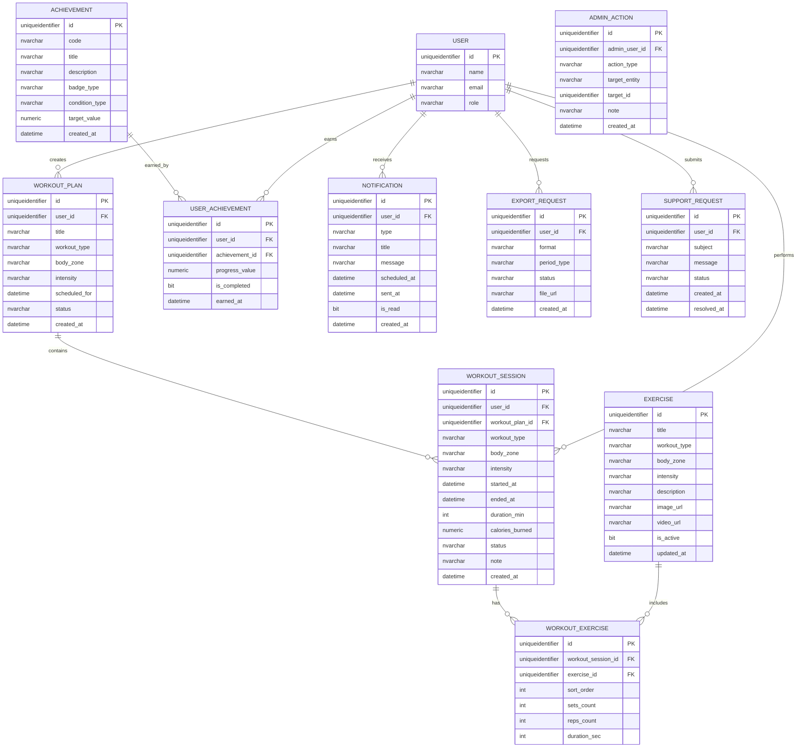

```mermaid
erDiagram
    USER {
        uniqueidentifier id PK
        nvarchar name
        nvarchar email
        nvarchar role
    }

    WORKOUT_PLAN {
        uniqueidentifier id PK
        uniqueidentifier user_id FK
        nvarchar title
        nvarchar workout_type
        nvarchar body_zone
        nvarchar intensity
        datetime scheduled_for
        nvarchar status
        datetime created_at
    }

    EXERCISE {
        uniqueidentifier id PK
        nvarchar title
        nvarchar workout_type
        nvarchar body_zone
        nvarchar intensity
        nvarchar description
        nvarchar image_url
        nvarchar video_url
        bit is_active
        datetime updated_at
    }

    WORKOUT_SESSION {
        uniqueidentifier id PK
        uniqueidentifier user_id FK
        uniqueidentifier workout_plan_id FK
        nvarchar workout_type
        nvarchar body_zone
        nvarchar intensity
        datetime started_at
        datetime ended_at
        int duration_min
        numeric calories_burned
        nvarchar status
        nvarchar note
        datetime created_at
    }

    WORKOUT_EXERCISE {
        uniqueidentifier id PK
        uniqueidentifier workout_session_id FK
        uniqueidentifier exercise_id FK
        int sort_order
        int sets_count
        int reps_count
        int duration_sec
    }

    ACHIEVEMENT {
        uniqueidentifier id PK
        nvarchar code
        nvarchar title
        nvarchar description
        nvarchar badge_type
        nvarchar condition_type
        numeric target_value
        datetime created_at
    }

    USER_ACHIEVEMENT {
        uniqueidentifier id PK
        uniqueidentifier user_id FK
        uniqueidentifier achievement_id FK
        numeric progress_value
        bit is_completed
        datetime earned_at
    }

    NOTIFICATION {
        uniqueidentifier id PK
        uniqueidentifier user_id FK
        nvarchar type
        nvarchar title
        nvarchar message
        datetime scheduled_at
        datetime sent_at
        bit is_read
        datetime created_at
    }

    EXPORT_REQUEST {
        uniqueidentifier id PK
        uniqueidentifier user_id FK
        nvarchar format
        nvarchar period_type
        nvarchar status
        nvarchar file_url
        datetime created_at
    }

    SUPPORT_REQUEST {
        uniqueidentifier id PK
        uniqueidentifier user_id FK
        nvarchar subject
        nvarchar message
        nvarchar status
        datetime created_at
        datetime resolved_at
    }

    ADMIN_ACTION {
        uniqueidentifier id PK
        uniqueidentifier admin_user_id FK
        nvarchar action_type
        nvarchar target_entity
        uniqueidentifier target_id
        nvarchar note
        datetime created_at
    }

    USER ||--o{ WORKOUT_PLAN : creates
    USER ||--o{ WORKOUT_SESSION : performs
    USER ||--o{ USER_ACHIEVEMENT : earns
    USER ||--o{ NOTIFICATION : receives
    USER ||--o{ EXPORT_REQUEST : requests
    USER ||--o{ SUPPORT_REQUEST : submits
    WORKOUT_PLAN ||--o{ WORKOUT_SESSION : contains
    EXERCISE ||--o{ WORKOUT_EXERCISE : includes
    WORKOUT_SESSION ||--o{ WORKOUT_EXERCISE : has
    ACHIEVEMENT ||--o{ USER_ACHIEVEMENT : earned_by
```