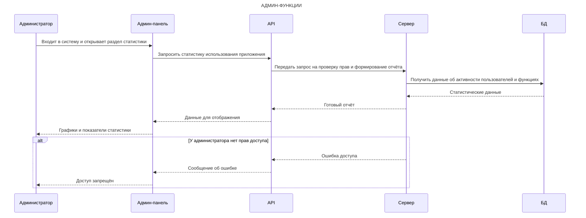

```mermaid
sequenceDiagram
    title АДМИН-ФУНКЦИИ
    participant Adm as Администратор
    participant AP as Админ-панель
    participant API as API
    participant S as Сервер
    participant DB as БД

    Adm->>AP: Входит в систему и открывает раздел статистики
    AP->>API: Запросить статистику использования приложения
    API->>S: Передать запрос на проверку прав и формирование отчёта
    S->>DB: Получить данные об активности пользователей и функциях
    DB-->>S: Статистические данные
    S-->>API: Готовый отчёт
    API-->>AP: Данные для отображения
    AP-->>Adm: Графики и показатели статистики

    alt У администратора нет прав доступа
        S-->>API: Ошибка доступа
        API-->>AP: Сообщение об ошибке
        AP-->>Adm: Доступ запрещён
    end
```