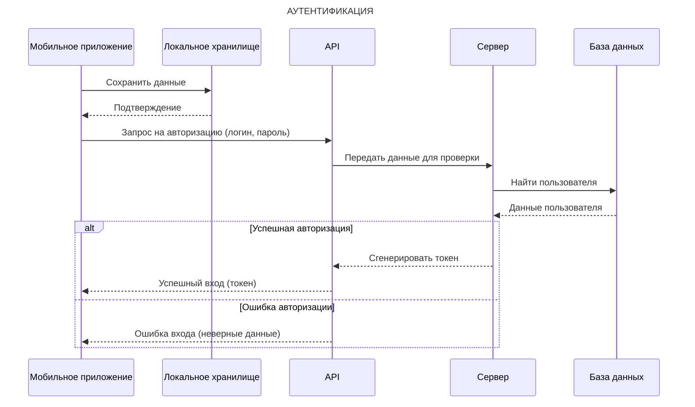

```mermaid
sequenceDiagram
    title АУТЕНТИФИКАЦИЯ
    participant App as Мобильное приложение
    participant LS as Локальное хранилище
    participant API as API
    participant Server as Сервер
    participant DB as База данных

    App->>LS: Сохранить данные
    LS-->>App: Подтверждение

    App->>API: Запрос на авторизацию (логин, пароль)
    API->>Server: Передать данные для проверки
    Server->>DB: Найти пользователя
    DB-->>Server: Данные пользователя

    alt Успешная авторизация
        Server-->>API: Сгенерировать токен
        API-->>App: Успешный вход (токен)
    else Ошибка авторизации
        API-->>App: Ошибка входа (неверные данные)
    end
```