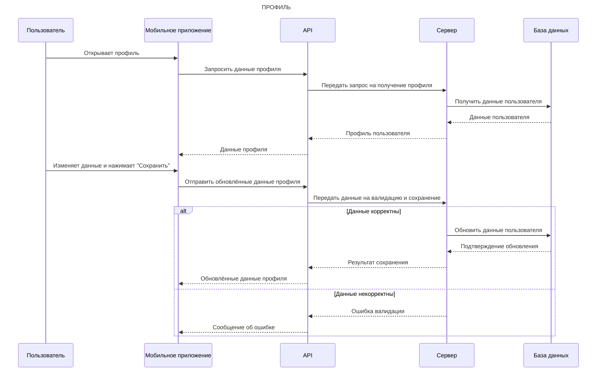

```mermaid
sequenceDiagram
    title ПРОФИЛЬ
    participant U as Пользователь
    participant A as Мобильное приложение
    participant API as API
    participant S as Сервер
    participant DB as База данных

    U->>A: Открывает профиль
    A->>API: Запросить данные профиля
    API->>S: Передать запрос на получение профиля
    S->>DB: Получить данные пользователя
    DB-->>S: Данные пользователя
    S-->>API: Профиль пользователя
    API-->>A: Данные профиля

    U->>A: Изменяет данные и нажимает "Сохранить"
    A->>API: Отправить обновлённые данные профиля
    API->>S: Передать данные на валидацию и сохранение

    alt Данные корректны
        S->>DB: Обновить данные пользователя
        DB-->>S: Подтверждение обновления
        S-->>API: Результат сохранения
        API-->>A: Обновлённые данные профиля
    else Данные некорректны
        S-->>API: Ошибка валидации
        API-->>A: Сообщение об ошибке
    end
```