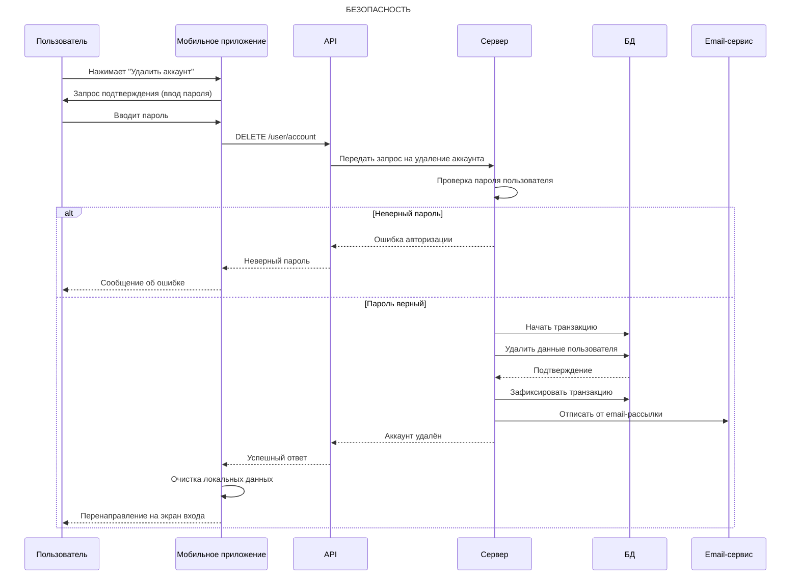

```mermaid
sequenceDiagram
    title БЕЗОПАСНОСТЬ
    participant U as Пользователь
    participant App as Мобильное приложение
    participant API as API
    participant S as Сервер
    participant DB as БД
    participant ES as Email-сервис

    U->>App: Нажимает "Удалить аккаунт"
    App->>U: Запрос подтверждения (ввод пароля)
    U->>App: Вводит пароль

    App->>API: DELETE /user/account
    API->>S: Передать запрос на удаление аккаунта

    S->>S: Проверка пароля пользователя

    alt Неверный пароль
        S-->>API: Ошибка авторизации
        API-->>App: Неверный пароль
        App-->>U: Сообщение об ошибке
    else Пароль верный
        S->>DB: Начать транзакцию
        S->>DB: Удалить данные пользователя
        DB-->>S: Подтверждение
        S->>DB: Зафиксировать транзакцию

        S->>ES: Отписать от email-рассылки

        S-->>API: Аккаунт удалён
        API-->>App: Успешный ответ
        App->>App: Очистка локальных данных
        App-->>U: Перенаправление на экран входа
    end
```